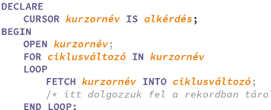

Dekralációs(elhagyható) és vezérlő szegmens(kötelező)
SET SERVEROUTPUT ON -- kiiratas engedelyezese
DBMS_OUTPUT.PUTLINE("printkent kiiratas");

Dekralációs szegmens
DECLARE- től a BEGIN- ig tart
- Lehet benne Plsql (skalar adat, összetett adat, pointer, LOB)
- Lehet benne NemPLsql (SQL*plus, forms képernyőmező )
CONSTANT, NOT NULL, DEFAULT = ":="
ÖSSZEFŰZÉS = "||"
input felvétele(DECLARE előtt kell meghivni): ACCEPT valtozo PROMPT 'add meg az erteket';
v_valtozo := '&valtozo'
Konvenciók: v_* valtozo, c_* konstans, h_* sql*plus, p_* parameter
Custom Rekordtipus --> TYPE rekordtupusnev IS RECORD (mezonev tipus, ..., mezonev CHAR(20pl.);
SQLben nem lehet valtozokban tarolni, PLslqben igen ->> Select x1.. INTO v1.., FROM tabla

Típus hivatkozások, változó vagy konstans dekralációkor --> 1. tabla.mezo%TYPE vagy 2. tabla%RAWTYPE
Pl.: v_x szemely.id%TYPE --> itt pl NUMBER ként jelenik meg a type, nem kell beirni kezzel
PL2.: v_2x szemely%ROWTYPE --> select * al ki tudjuk kérni a változóból a sorokat minthat [] lenne

Sorazonosító - ROWID
- meglevo rekord sorazonositojat lehet lekerni, attributumot meg lehet valtoztatni ROWID segitsegevel

# Vezérlési szerkezetek:
- IF feltetel THEN ||||| ELISIF, |||||| ELSE |||||| END IF; külön sor minden
- Aktuális rendszerdátum SYSDATE ||||| Időpont egy részének kinyerése: EXTRACT (HOUR FROM vege)
  - napok száma min str = TO_CHAR(SYSDATE, 'D') # a het elso napja vasarnap
- Esetkiválasztás: CASE valtozo \n WHEN feltetel THEN utasitas;\n... ... END CASE;
- Végtelen ciklus: LOOP utasitasok END LOOP; |||| kilépés a ciklusból: EXIT; ||| ue. feltétellel EXIT WHEN feltétel;
- For: FOR ciklusvalt IN alsohatar .. felsohatar LOOP utaitasok END LOOP;
  - alohatar mindig kisebb felsonel, visszafele= REVERSE alsohatar elé, IN után
- Eloltesztelős: WHILE feltétel LOOP utasitasok END LOOP;

# Kurzorok
- def: mutatók feldolgozás alatt lévő(CRUD) adathatlmaz rekordjára mutat
    - IMplicit: CUD és nem explicit Read esetén létrejön, nem lehet névvel hivatkozni rá(nincs alias) -> Max 1 rekordot ad vissza(vagy 0)
    - EXplicit: Dekraléciós szegmensben dekralálni kell, névvel rendelkezik --> Rekordok külön-külön kezelésére
- DECLARE \n\t CURSOR kurzornev IS alkerdes;\n rekord rekordtipus
- BEGIN \n\t OPEN kurzornev; --> az eredmenytabla a memoriaban tarolodik (ekkor a kurzor az első sor elé mutat)
  - Számítunk arra, hogy a kurzor több rekordot ad vissza --> ciklussal olvasunk be
  - LOOP \n FETCH kurzornev INTO rekord; -->segedvaltozoba masoljuk az aktualis rekordot(sort)
  - EXIT WHEN kiugrasi_feltetel;\n END LOOP --> vagy végigmegyünk az összes elemen, vagy brakelünk
- CLOSE kurzornev

## Kurzorfüggvények
Implicit kurzor=SQL%KURZOR_FGV , Explicit kurzor = kurzornev%KURZOR_FGV
- NOTFOUND: return True, ha nem sikerült adatot feldolgozni a kurzornak --> pl lekerdezés utolsó adatját is feldolgoztuk(vagy 1 adat sem volt)
- FOUND: retunr True, ha sikerül adatot feldolgozni
- ROWCOUNT: az addig feldolgozott sorok száma, de arra is jó ha pl módosíunk, hány sor módosult(rekord)
  - 

## Paraméteres kurzorok
- dekraláció során: CURSOR kurzornev (p_parameter1 tipus, p_para2 tipus...) IS alkerdes;\n rekord rekordtipus;
- parameter megadasa a kurzor megnyitasakor: OPEN kurzornenv(1234, "proba"); 

## Adatmódosítás(UPDATE) explicit kurzorral
- OKA lehet pl , feltételek vizsgálata kurzor indítása előtt, vagy korábbi értékek lementése (ami változik majd)
- 
- NOWAIT: ha van másik művelet ami a vizsgált rekordal dolgozik, dobjon hibaüzentet, ugorjon tovább, ne várjon

- CURRENT OF: módosítást azon a rekordon hajtsák végre a műveletet ahol a kurzor van

# Kivételkezelés
EXCEPTION
  WHEN kivetel OR kivetel THEN
    utasitasok
  WHEN OTHERS THEN

- DUP_VAL_ON_INDEX: INSERT vagy UPDATE esetén meglévő indexre akarunk beszúrni
- TIMEOUT_ON_RESOURCE: időtúllépés
- NO_DATA_FOUND: egy lekérdezés nem ad vissza rekordot(nem kurzor)
- TOO_MANY_ROWS: egy lekérdezés 1 nél több értékkel tér vissza és ezt próbáljuk változóban tárolni
- INVALID_NUMBER: számmá konvertálás sikertelen
