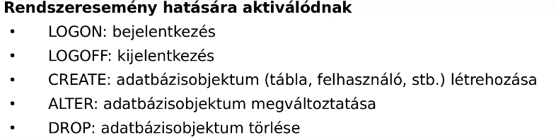
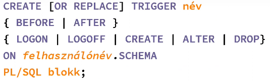

- OR REPLACE: meglévő trigger felülírása
- BEFORE AFTER - fizikai tabla, INSTEAD OF - nezettabla
- 1 táblát lehet megadni egy triggerhez
- REFERENCING: milyen néven hivatkozzuk a régi és új értékeket
- INSERT: NEW, UPDATE: OLD és NEW, DELETE: OLD
- FOR EACH ROW: minden érintett sor esetén hajtódjon végre
     - alapból sor szintű ,elenkező esetben utasitas szintu trigger

Ha letiltom, nem törlődik, de nem is aktiválódik
# RENDSZERTRIGGER

Bejelentkezésnél mindig after , kijelentkezesnel mindig before triggert kell hasznalni, (mert ugy erjuk el a tablat)

