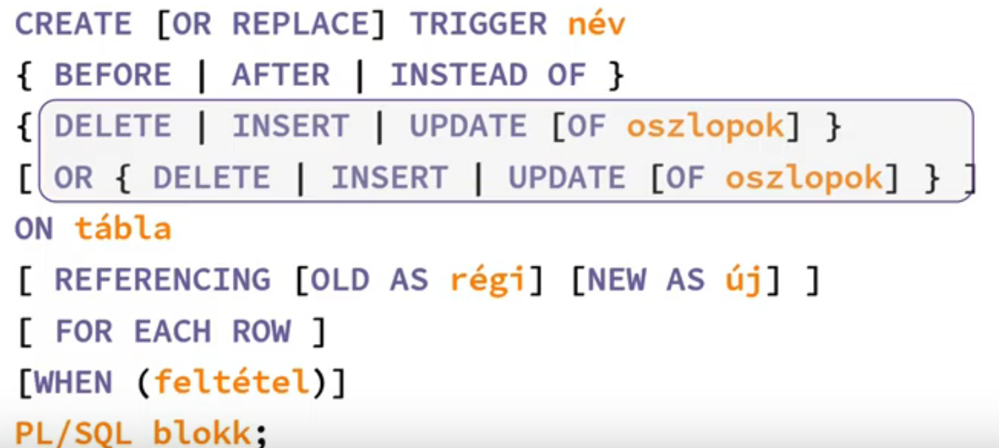
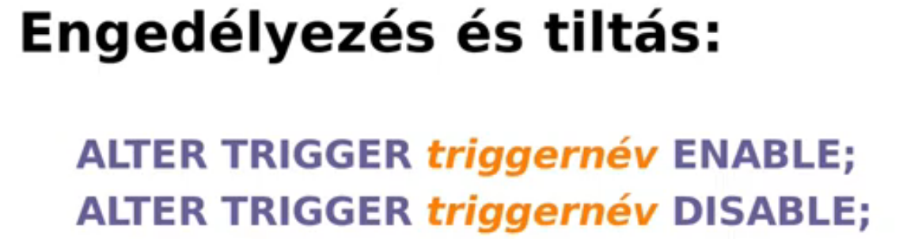

BEFORE AFTER - fizikai tabla, INSTEAD OF - nezettabla

1 táblát megadni egy triggerhez
REFERENCING: milyen néven hivatkozzuk a régi és új értékeket
INSERT: NEW, UPDATE: OLD és NEW, DELETE: OLD
FOR EACH ROW: minden érintett sor esetén hajtódjon végre
                elenkező esetben utasitas szintu trigger
PL/SQL BLOKK;

Ha letiltom, nem törlődik, de nem is aktiválódik
